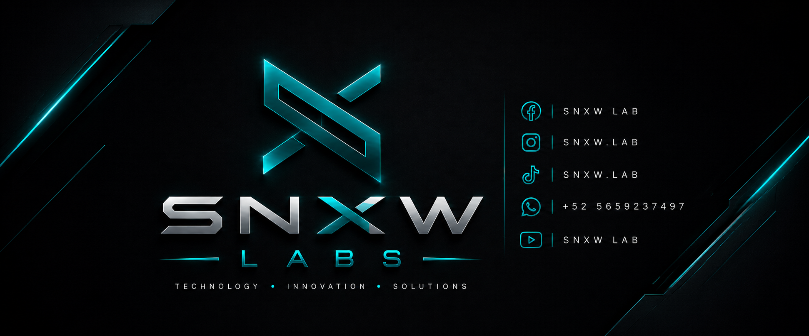

  

<h1 align="center">Hi, I'm Julio 👋</h1>

Engineering • Infrastructure • Linux • Automation • Software Development

---

## 🚀 About Me

I'm an engineer passionate about building practical technology solutions.

My interests span infrastructure, Linux, automation, software development, networking, cybersecurity and game development.

Through **SNXW LABs**, I explore new technologies, develop software, automate workflows and create projects that solve real-world problems.

I believe the best way to learn is by building.

---

## 💻 What I Work With

### Infrastructure

- Windows Server
- Linux Servers
- Active Directory
- Networking
- Hyper-V
- Virtualization
- Backup Solutions
- IT Administration

### Development

- Python
- GDScript
- HTML
- CSS
- JavaScript
- SQL

### Tools

- Git
- GitHub
- VS Code
- Godot Engine
- Docker (Learning)

### Operating Systems

- CachyOS
- Windows

---

## 🚀 Main Projects

### 🛰️ SNXW LABs

Personal technology laboratory where I experiment with Linux, automation, infrastructure, software development and engineering.

---

### 📦 SpaceRacks

Internal platform focused on infrastructure administration, server management, inventory, IT operations and digital tools for business environments.

---

### 🎮 Last Road

Video game currently under development using Godot Engine.

---

## 📚 Currently Learning

- Advanced Git & GitHub
- Linux Administration
- Python
- Godot
- Docker
- DevOps
- Cloud Infrastructure

---

## 🎯 Goals

- Publish Open Source projects
- Expand SNXW LABs
- Improve SpaceRacks
- Release my first complete game
- Continue learning every day

---

## 📊 GitHub Stats

---

## ⚡ Interests

- Linux
- Servers
- Automation
- Networking
- Cybersecurity
- Software Engineering
- Game Development
- AI

---

<b>Building ideas into reality.</b>

SNXW LABs 🚀

